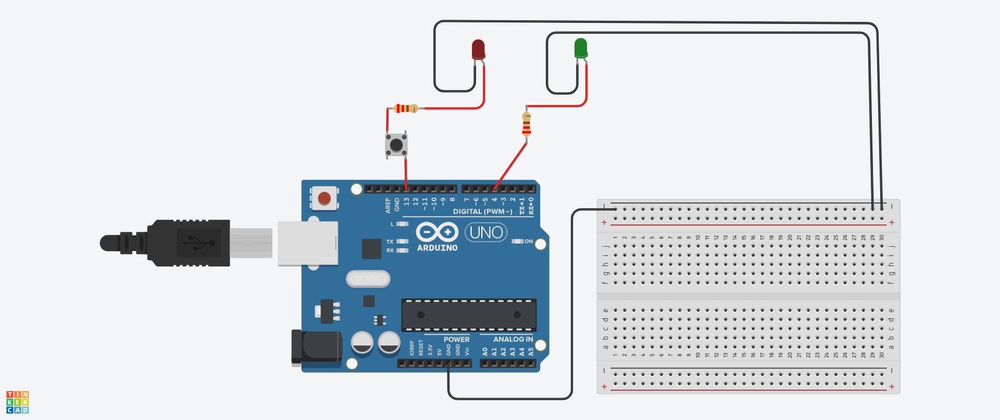

# Curso-Extens-o-IoT-Iniciantes
Curso de Extensão IoT na prática para iniciantes
   
Sumário  
<a href="#nodemcu-link">Aula 5 - 24/09/2022 - Piscando o led embarcado de um ESP8266</a>

1) projeto Pisca Pisca: 1e1313e134k13perk13prk13prk1p3rk1p3rkp13rkp13krp13rk1p3rk1p3rk1p3rkp13rkp13rkp13rk1p3rkp13rkp1k

<a href="piscapisca.ino">Clique aqui para o código</a>

2) Projeto Fotorresistor com Leds Verde e Vermelho 
No TinkerCad, crie o circulo conforme figura abaixo: 
 
 
Na programação em blocos, faça assim: 
 
 
<a href="exemploComSensorDeMovimentoEBuzzer.ino">Clique aqui para o código</a>

3) Projeto Sensor de Movimento com Buzzer 
No TinkerCad, crie o circulo conforme figura abaixo: 
 
 
Na programação em blocos, faça assim: 
 
 
<a href="exemploComSensorDeMovimentoEBuzzer.ino">Clique aqui para o código</a>

   
AULA 24/09/2022
   
<a name="nodemcu-link">Exemplo 1) Piscando o led embarcado de um ESP8266</a>
  
<a href="nodemcu_blink.ino">Baixe aqui o código</a>

